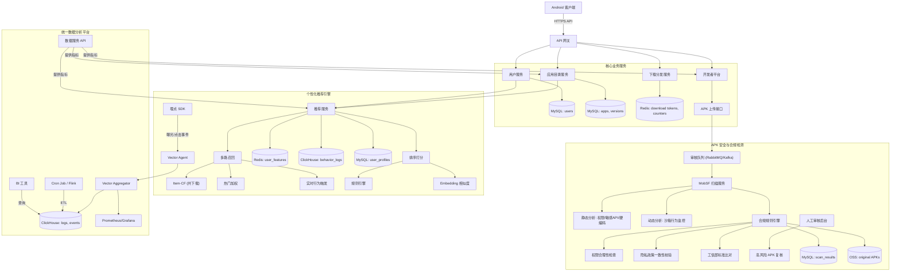

```mermaid
graph TD
    %% ====================== 客户端接入层 ======================
    A[Android 客户端] -->|HTTPS API| B[API 网关]
    B --> C[用户服务]
    B --> D[应用目录服务]
    B --> E[下载分发服务]
    B --> F[开发者平台]

    %% ====================== 核心业务服务层 ======================
    subgraph "核心业务服务"
        C --> G[(MySQL: users)]
        D --> H[(MySQL: apps, versions)]
        E --> I[(Redis: download tokens, counters)]
        F --> J[APK 上传接口]
    end

    %% ====================== 个性化推荐模块 ======================
    subgraph "个性化推荐引擎"
        K[推荐服务] --> L["多路召回"]
        L --> M["Item-CF (共下载)"]
        L --> N["热门加权"]
        L --> O["实时行为触发"]
        
        K --> P["排序打分"]
        P --> Q["规则引擎"]
        P --> R["Embedding 相似度"]
        
        K --> S[(Redis: user_features)]
        K --> T[(ClickHouse: behavior_logs)]
        K --> U[(MySQL: user_profiles)]
        
        V[埋点 SDK] -->|曝光/点击事件| W[Vector Agent]
    end

    D --> K
    C --> K

    %% ====================== APK 合规检测模块 ======================
    subgraph "APK 安全与合规检测"
        J --> X["审核队列 (RabbitMQ/Kafka)"]
        X --> Y["MobSF 扫描服务"]
        Y --> Z["静态分析: 权限/敏感API/硬编码"]
        Y --> AA["动态分析: 沙箱行为监控"]
        
        AB["合规规则引擎"] --> AC["权限合理性检查"]
        AB --> AD["隐私政策一致性校验"]
        AB --> AE["工信部标准比对"]
        
        AF["人工审核后台"] --> AG["高风险 APK 复核"]
        
        Y --> AB
        AB --> AH[(MySQL: scan_results)]
        AB --> AI[(OSS: original APKs)]
    end

    %% ====================== 数据分析体系 ======================
    subgraph "统一数据分析平台"
        W --> AJ[Vector Aggregator]
        AJ --> AK[(ClickHouse: logs, events)]
        AJ --> AL[Prometheus/Grafana]
        
        AM["Cron Job / Flink"] -->|ETL| AK
        AN["BI 工具"] -->|查询| AK
        
        AO["数据服务 API"] -->|提供指标| D
        AO -->|提供指标| K
        AO -->|提供指标| F
    end

    %% =======
```
